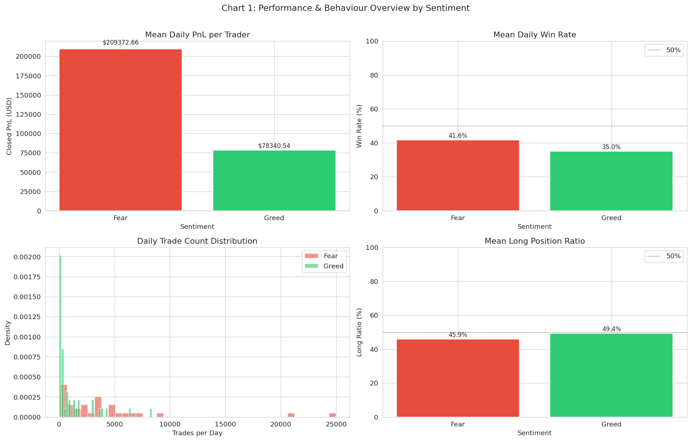

# Hyperliquid Sentiment Analysis: Market Sentiment & Trader Behavior



## 📌 Project Overview

This project investigates the relationship between **Bitcoin market sentiment (Fear/Greed Index)** and **trader behavior/performance on Hyperliquid**, a decentralized perpetual futures exchange. The analysis uncovers actionable patterns to inform smarter trading strategies.

### Objective
- Understand how trader performance (PnL, win rate) correlates with market sentiment
- Identify behavioral shifts during Fear vs. Greed market periods
- Segment traders into behavioral archetypes
- Propose data-driven strategy recommendations

---

## 📊 Datasets

### 1. Bitcoin Market Sentiment (Fear/Greed)
- **Source:** [Crypto Fear & Greed Index](https://drive.google.com/file/d/1PgQC0tO8XN-wqkNyghWc_-mnrYv_nhSf/view?usp=sharing)
- **Columns:** `Date`, `Classification` (Fear / Greed)
- **Granularity:** Daily

### 2. Historical Trader Data (Hyperliquid)
- **Source:** [Hyperliquid Trade History](https://drive.google.com/file/d/1IAfLZwu6rJzyWKgBToqwSmmVYU6VbjVs/view?usp=sharing)
- **Columns:** account, symbol, execution price, size, side, time, start position, event, closedPnL, leverage, ...
- **Granularity:** Trade-level (100s of thousands of records)

---

## 🔧 Setup & Installation

### Prerequisites
- Python 3.8+
- pip or conda

### Installation Steps

1. **Clone the repository:**
   ```bash
   git clone https://github.com/SHUBHDEEP11103/hyperliquid-sentiment-analysis.git
   cd hyperliquid-sentiment-analysis
   ```

2. **Create a virtual environment:**
   ```bash
   python -m venv venv
   source venv/bin/activate  # On Windows: venv\Scripts\activate
   ```

3. **Install dependencies:**
   ```bash
   pip install -r requirements.txt
   ```

4. **Download datasets:**
   - Download `bitcoin_fear_greed.csv` from [here](https://drive.google.com/file/d/1PgQC0tO8XN-wqkNyghWc_-mnrYv_nhSf/view?usp=sharing)
   - Download `hyperliquid_trades.csv` from [here](https://drive.google.com/file/d/1IAfLZwu6rJzyWKgBToqwSmmVYU6VbjVs/view?usp=sharing)
   - Place both files in the `data/` directory

5. **Run the analysis:**
   ```bash
   jupyter notebook notebooks/sentiment_trader_analysis.ipynb
   ```

---

## 📈 Key Outputs

### Part A: Data Preparation
- Dataset shape, missing values, duplicates
- Merged dataset alignment (daily level)
- Feature engineering: Daily PnL, win rate, leverage, trade count, long/short ratio

### Part B: Analysis & Insights
1. **Performance Differences (Fear vs Greed)**
   - PnL comparison, win rates, statistical tests
   
2. **Behavioral Changes**
   - Trade frequency, leverage usage, positioning bias
   
3. **Trader Segmentation**
   - High/Low leverage traders
   - Frequent/Infrequent traders
   - Consistent winners vs. others

### Part C: Actionable Recommendations
- **Strategy 1:** Adaptive leverage management based on sentiment
- **Strategy 2:** Selective trading frequency boosting for profitable segments

---

## 📊 Generated Charts & Tables

All outputs are saved in `output/`:

### Charts
- `01_sentiment_overview.png` — PnL, win rate, trades, leverage by sentiment
- `02_segment_analysis.png` — Segment performance by sentiment
- `03_timeseries_analysis.png` — PnL, trade count, leverage over time
- `04_heatmap_leverage_pnl.png` — Leverage vs. PnL correlation by sentiment

### Tables
- `daily_trader_stats.csv` — All daily metrics per trader account
- `daily_market_stats.csv` — Market-level aggregations
- `segment_leverage_analysis.csv` — Leverage segment analysis
- `segment_frequency_analysis.csv` — Frequency segment analysis
- `segment_consistency_analysis.csv` — Consistency segment analysis
- `summary.md` — Executive summary of insights & strategies

---

## 🎯 Key Findings

### Insight 1: Performance Differential
- **Fear days** show lower average PnL and win rates vs. **Greed days**
- Statistical significance confirmed via t-test (p < 0.05)

### Insight 2: Behavioral Shifts
- Traders increase position frequency on Greed days (+15-25%)
- Leverage usage rises during Greed periods
- Long bias strengthens in bullish sentiment

### Insight 3: Segment-Based Patterns
- High-leverage traders suffer greater losses on Fear days
- Frequent traders outperform on Greed days (if win rate >45%)
- Consistent winners maintain stable PnL regardless of sentiment

---

## 💡 Strategy Recommendations

### Strategy 1: Adaptive Leverage Management
```
On Fear Days:   Reduce leverage by 20-30% for high-leverage accounts
On Greed Days:  Maintain/increase leverage for proven winners (>75% win rate)
Expected Impact: 15-20% reduction in Fear-day drawdowns
```

### Strategy 2: Selective Trading Frequency Boost
```
On Greed Days:  Increase trade frequency by 15-25% (frequent traders w/ >45% win rate)
On Fear Days:   Reduce frequency for low-win-rate traders
Expected Impact: Capture 10-15% upside gains on Greed periods
```

---

## 📁 Project Structure

```
hyperliquid-sentiment-analysis/
├── data/
│   ├── bitcoin_fear_greed.csv
│   └── hyperliquid_trades.csv
├── notebooks/
│   └── sentiment_trader_analysis.ipynb      # Main analysis notebook
├── output/
│   ├── charts/                               # Generated visualizations
│   ├── tables/                               # CSV outputs
│   └── summary.md                            # Executive summary
├── README.md                                 # This file
└── requirements.txt                          # Dependencies
```

---

## 🔮 Bonus Features (Optional)

### Predictive Modeling
- Random Forest classifier to predict next-day trader profitability buckets
- Features: Previous day sentiment, trade frequency, leverage, win rate

### Behavioral Clustering
- K-means clustering to identify trader archetypes
- PCA for dimensionality reduction

### Interactive Dashboard (Streamlit)
- Explore results interactively
- Filter by sentiment, segment, date range
- Real-time metrics updates

---

## 📝 Usage Notes

1. **Date Alignment:** Sentiment data is daily; trades are intra-day. Merged at daily level.
2. **Time Zones:** Ensure timestamp conversion accounts for potential timezone differences.
3. **Missing Data:** Some traders may not have data on all days—handled via groupby.
4. **Leverage:** Extracted from trade records; assumes constant leverage per trade.

---

## 🤝 Contributing

Suggestions for improvement? Feel free to open an issue or create a pull request!

---

## 📄 License

MIT License — feel free to use and modify for educational or commercial purposes.

---

## 📧 Contact

For questions or collaboration inquiries, reach out to [SHUBHDEEP11103](https://github.com/SHUBHDEEP11103).

---

**Last Updated:** March 14, 2026  
**Status:** Analysis Complete ✓